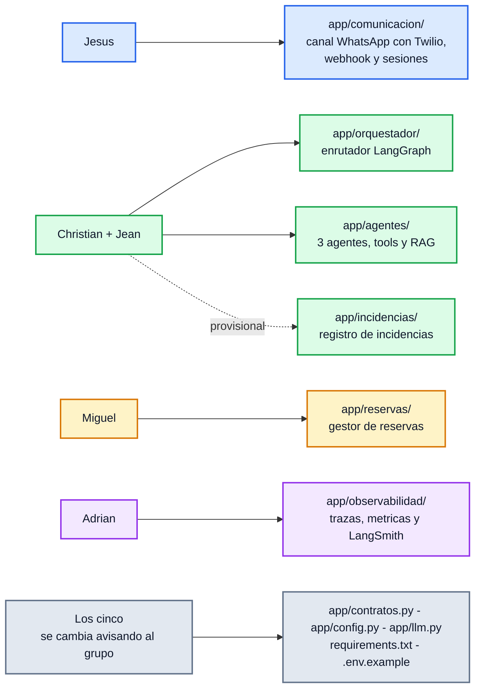

# Acuerdos de trabajo — Grupo 02 (Clemente)

> **Registro histórico de acuerdos iniciales.** Conserva la arquitectura de tres agentes y las
> tareas definidas antes del cambio acordado el 2026-09-07. Para conocer la arquitectura de dos
> agentes especialistas con orquestador, y el estado implementado y medido más reciente, consulte el
> [`README.md`](README.md) y los informes de [`docs/`](docs/).

Cómo trabajamos los cinco sobre el mismo código sin pisarnos. Lo de la sección 1 ya está
acordado; lo de la sección 7 es lo que falta cerrar.

---

## 1. Decisiones ya tomadas

| Decisión | Detalle |
|---|---|
| **Alcance del entregable** | Solo los **tres agentes**: Reservas y Capacidad, Incidencias y Experiencia, Conocimiento. Pedidos, delivery y recojo quedan **fuera**. |
| **Canal** | **WhatsApp vía Twilio**, y nada más. El webchat del proyecto es solo para desarrollar y demostrar sin depender de Twilio. |
| **Razonamiento del LLM** | Sobre **API**: Anthropic (`AGENT_MODEL=claude`) u OpenAI (`AGENT_MODEL=openai`). Ollama queda como respaldo para trabajar sin conexión. |
| **Embeddings del RAG** | Locales y gratuitos (`nomic-embed-text` en Ollama), salvo que se ponga `EMBEDDINGS_BACKEND=openai`. |
| **Observabilidad** | **LangSmith activo** (`LANGSMITH_TRACING=true`) sobre un proyecto **compartido**, `clemente-grupo02`, más las trazas propias del sistema. |
| **Arquitectura** | Topología *Supervisor*: un enrutador decide y despacha a uno de los tres agentes. |

## 2. Responsabilidades

| Frente | Responsable | Carpeta que le pertenece |
|---|---|---|
| Gestión de comunicación **y conexión con WhatsApp (Twilio)** | Jesús | `app/comunicacion/` |
| **Orquestador** + los 3 agentes + RAG | Christian, Jean | `app/orquestador/`, `app/agentes/` |
| Gestor de reservas | Miguel | `app/reservas/` |
| Observabilidad | Adrián | `app/observabilidad/` |
| Registro de incidencias | Christian y Jean (provisional) | `app/incidencias/` — puede pasar a Miguel si se unifica el almacenamiento |

**Archivos compartidos** (nadie los edita solo; se cambian avisando al grupo):
`app/contratos.py`, `app/config.py`, `app/llm.py`, `app/__init__.py`, `requirements.txt`, `.env.example`.

## 3. Por qué existe `app/contratos.py`

Es lo que permite que cinco personas avancen en paralelo desde el primer día: define **qué datos
se pasa un módulo a otro**, no cómo los produce.

- Los agentes llaman a `ServicioReservas` sin saber si detrás hay un JSON, SQLite o el sistema
  del restaurante. Miguel puede reescribir su módulo entero mientras respete esa interfaz.
- El orquestador recibe un `MensajeEntrante` y devuelve una `RespuestaClemente`, sin saber si el
  mensaje vino de WhatsApp o del webchat.
- Adrián recibe `Traza` de todos los módulos con la misma forma.

**Mientras `contratos.py` no cambie, nadie rompe a nadie.** Si alguien necesita un campo nuevo,
lo avisa antes de subirlo: es el único archivo donde un cambio silencioso le cuesta tiempo a los
otros cuatro.

## 4. Ambiente de desarrollo común

1. **Python 3.11+** (probado en 3.13) y un entorno virtual por persona (`.venv/`, fuera de git).
2. **Dependencias solo desde `requirements.txt`**. Quien necesite una librería nueva la agrega
   ahí en el mismo *commit* donde la usa, y lo avisa.
3. **Modelo por API**, elegido en el `.env` con `AGENT_MODEL`. Cambiar de proveedor o de modelo
   no toca código.
4. **Configuración por `.env`**, nunca dentro del código. Se sube `.env.example`, nunca el `.env`.
5. **Nadie sube claves de API** al repositorio; van en el `.env`, que está en `.gitignore`. Si
   una se filtra, se revoca ese mismo día. Conviene además ponerle **límite de gasto mensual** a
   la clave en la consola del proveedor: cinco personas iterando con agentes que encadenan
   llamadas a herramientas gastan más rápido de lo que parece.

Verificación de que el ambiente está bien: `pytest -q` en verde y `python run.py` sirviendo el
chat en <http://localhost:5000>, con `GET /api/salud` devolviendo `estado: ok`.

## 5. Git y GitHub

Repositorio del grupo: <https://github.com/JesusBarboza1994/ai_agents_utec>

Pendientes ahí (hoy el repositorio solo tiene los archivos sueltos de una sesión de clase):

1. **Accesos**: Jesús agrega a los cuatro como *collaborators* (Settings → Collaborators). Sin
   eso, el resto no puede subir ramas.
2. **Estructura**: subir este esqueleto como base del proyecto y mover lo de las sesiones
   anteriores a `archivo/`.
3. **Rama `main` protegida**: nadie sube directo a `main`; todo entra por *pull request*.
4. **Una rama por trabajo**, con el nombre del frente: `feat/comunicacion-twilio`,
   `feat/orquestador-ruteo`, `feat/agentes-reservas`, `feat/reservas-sqlite`,
   `feat/observabilidad-langsmith`.
5. **Un *commit* por cambio**, con mensaje que diga qué cambió y por qué, en español.
6. **Un *pull request* por rama**, revisado por al menos una persona más. Si toca
   `contratos.py`, lo revisan los dos frentes afectados.
7. **Antes de subir**: `pytest -q` en verde.

## 6. Definición de "terminado"

Una pieza está terminada cuando:

- corre en la máquina de otra persona del equipo siguiendo solo el `README.md`;
- tiene al menos una prueba en `tests/` que la cubra (o una razón explícita de por qué no);
- deja traza: se puede ver en `GET /api/trazas` y en LangSmith qué hizo;
- está documentada en el `README.md` si cambia cómo se levanta o se usa el proyecto.

## 7. Lo que falta cerrar

### 7.1 Persistencia — **SQLite, cerrado**

`ServicioReservasSQLite` (`app/reservas/servicio_sqlite.py`) implementa `ServicioReservas` sobre
`sqlite3`, sin servidor ni dependencia nueva. Cada `crear_reserva`/`modificar_reserva` corre en
una transacción `BEGIN IMMEDIATE`, que serializa a los escritores: dos reservas simultáneas sobre
la misma mesa ya no se pisan.

Se activa con `CLEMENTE_BACKEND_RESERVAS=sqlite` en el `.env` (por defecto sigue en `json`);
**ningún agente se entera del cambio**, porque `app/reservas/__init__.py` es el único que decide
la implementación. El archivo `.db` no se sube a git (`.gitignore`): se regenera con
`python -m app.reservas.seed [--con-ejemplos]`, reproducible en cualquier máquina. Las 7 pruebas
de `tests/test_reservas.py` corren parametrizadas contra `json` **y** `sqlite`.

**Dónde vive el archivo y en qué máquina.** La base vive **siempre junto a la aplicación**, en
la máquina donde corre Flask (`app/reservas/datos/clemente.db`):

- **Para desarrollar**: cada uno tiene la suya, generada con el mismo `seed.py`. Nadie depende
  de que otro tenga la computadora encendida.
- **Para las pruebas integradas y la demostración final**: la aplicación corre en **una sola
  máquina, la de Jesús**, porque el webhook de Twilio necesita una URL pública (por ejemplo con
  *ngrok*) apuntando a esa máquina — y la base vive ahí, al lado de la aplicación. Consecuencia
  práctica: esa computadora tiene que estar encendida durante la demostración, y conviene
  ensayarlo antes, no el mismo día.

*Plan B, solo si aparece la necesidad*: una base **PostgreSQL gestionada gratuita** (Neon o
Supabase) con un `DATABASE_URL` en el `.env` de cada uno. Sirve si los cinco necesitan escribir
sobre los mismos datos sin depender de una máquina encendida. Cuesta media hora de configuración
y agrega dependencia de red; no vale la pena antes de que el problema exista.

### 7.2 LangSmith — falta la cuenta compartida

`LANGSMITH_TRACING=true` ya es el valor por defecto y el proyecto se llama `clemente-grupo02`.
Falta lo administrativo, y es de Adrián:

- Si **cada uno usa su propia clave**, las trazas quedan en la cuenta de cada uno y **no se ven
  juntas**, aunque el nombre del proyecto coincida.
- La forma simple de tenerlas en un solo lugar es **una clave del proyecto compartida por los
  cinco**; la alternativa es un espacio de trabajo con los cinco como miembros, y ahí hay que
  confirmar cuántos asientos permite el plan que tengan.

### 7.3 Otras decisiones abiertas

1. **Dónde vive el registro de incidencias**: ¿se queda con los agentes o se unifica con el
   módulo de datos de Miguel cuando pase a SQLite?
2. **Modelo exacto**: `claude-sonnet-5` ($2/$10 por millón de tokens) para desarrollar y
   `claude-opus-5` ($5/$25) para la demostración es lo razonable; falta confirmarlo y decidir si
   cada uno pone su clave o usamos una sola con tope de gasto.
3. **Evaluación (Módulo 8)**: qué métricas presentamos — aciertos del enrutador, tasa de
   escalamiento, latencia por agente, alucinaciones detectadas. La línea base ya está medida con
   el modelo local (sección 9 del `README.md`); falta repetirla con el modelo de API.
4. **Reparto de la entrega final**: quién arma el informe, quién el diagrama, quién graba o
   presenta la demostración, y en qué fecha congelamos el código.

## 8. Cadencia sugerida

- Un punto de control corto por semana (30 minutos): qué avanzó cada frente, qué está bloqueado,
  qué contrato hay que cambiar.
- El código se integra a `main` continuamente, no la semana de la entrega.
- Una prueba de extremo a extremo (mensaje de cliente → respuesta → traza en LangSmith) cada
  semana, con los cinco módulos conectados, aunque estén incompletos.
