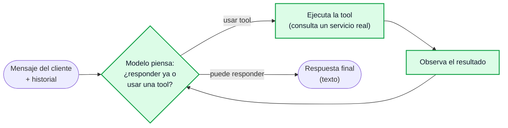

# Guía de implementación — Orquestador y Agentes (Christian + Jean)

Documento de coordinación entre los dos responsables de `app/orquestador/` y `app/agentes/`
(ver [`ACUERDOS_EQUIPO.md`](ACUERDOS_EQUIPO.md) §2). Cubre qué construir, con qué estructura,
cómo se reparte, y cómo queda todo medible para el informe del Módulo 8. No reemplaza al
[`README.md`](README.md) ni al [`Entregable N° 01`](../Entregable%20N%C2%B0%2001%20-%20GRUPO%2002.docx):
resume ambos en un plan accionable.

> **Nota de vocabulario**: cuando el Entregable 01 y el curso piden que los agentes tengan
> "estructura React", se refieren al patrón **ReAct** (*Reasoning + Acting*), no al framework de
> frontend — este proyecto no tiene ni necesita uno (el webchat es un template Flask/Jinja). Todo
> este documento usa "ReAct" en ese sentido. Si alguno de los dos venía entendiendo otra cosa,
> mejor aclararlo ahora que después del PR.

---

## 0. Decisiones a tomar juntos antes de repartirse el código

Estas cinco cosas las tiene que acordar el mismo par de personas que las va a usar — no tiene
sentido que cada uno las resuelva por su lado y descubran la discrepancia en el *merge*.

| # | Decisión | Por qué importa |
|---|---|---|
| 1 | Cómo viaja `escalado: bool` desde una *tool* (`escalar_a_staff`) hasta el `RespuestaClemente` final | El agente (`responder(texto, sesion_id, historial) -> str`) solo devuelve texto; `escalado` lo arma `grafo.py`. Hace falta un canal extra — ver §3. |
| 2 | Dónde vive `consultar_politica` | La piden Reservas, Incidencias *y* Conocimiento. Un solo módulo compartido, no tres copias. |
| 3 | Dónde vive `DecisionRuta` | No existe hoy en el repo (lo verifiqué). Probablemente en `app/orquestador/grafo.py`, pero decidir si conviene moverlo a `contratos.py` si Jesús o Adrián lo necesitan leer también. |
| 4 | Estrategia de *chunking* del RAG | Por encabezado Markdown (`##`) da fragmentos con sentido semántico propio; por tamaño fijo es más simple pero puede cortar una política a la mitad. |
| 5 | Qué campos exactos lleva cada `Traza` de agente | De esto dependen las métricas de evals (§7). Acordar el vocabulario de `evento` y `detalle` antes de instrumentar cada uno por su cuenta. |

---

## 1. El patrón ReAct, aplicado a Clemente

ReAct intercala razonamiento y acción en un ciclo: el modelo piensa, decide si necesita una
herramienta, la ejecuta, observa el resultado, y repite hasta poder responder. `create_agent` de
LangChain (`langchain>=1.0`, ya en `requirements.txt`) arma exactamente este ciclo como un grafo
de LangGraph por debajo — no hay que construirlo a mano.



**Regla dura para los tres agentes**: se construyen todos igual —

```python
from langchain.agents import create_agent

agente = create_agent(
    model=resolver_modelo(temperature=0.2),   # app/llm.py — nunca instanciar el modelo aparte
    tools=[...],                              # la caja de tools de ESE agente, nada más
    system_prompt=PROMPT_RESERVAS,            # app/agentes/prompts.py
)
```

y exponen la misma firma que ya tienen los *stubs* (no cambia, la usa `AGENTES` en
`app/agentes/__init__.py`):

```python
def responder(texto: str, sesion_id: str, historial: list[dict] | None = None) -> str:
    ...
```

Dentro de `responder`, arma la lista de `messages` desde `historial`, invoca `agente.invoke(...)`,
y devuelve el texto con `llm.extraer_texto(resultado)`. Lo que cambia entre los tres agentes es
**solo** el prompt y la caja de tools — nunca la forma de construirlos.

El **orquestador no es un agente ReAct**: es un clasificador de una sola pasada
(`with_structured_output`, sin *loop*, sin tools) que despacha a uno de los tres. Ver §5.

---

## 2. Reparto sugerido

Punto de partida para discutir con Christian, no un mandato — el orden de dependencia sí importa
más que quién hace qué:

| Bloque | Sugerencia | Por qué |
|---|---|---|
| Infraestructura compartida (`contexto.py`, `base.py`) | **Los dos, primero, en una llamada corta** | Bloquea todo lo demás; mejor definirla junta que negociarla por PR después. |
| Agente de Conocimiento + RAG (`conocimiento.py`, `rag/indice.py`) | Jean | Es el más simple (sin escrituras), buen lugar para dejar el patrón `create_agent` funcionando antes de los agentes con más guardrails. |
| Orquestador (`grafo.py`, `DecisionRuta`) | Jean | Puede desarrollarse y probarse contra los *stubs* actuales — no depende de que Reservas/Incidencias estén terminados. |
| Agente de Reservas (`reservas.py`) | Christian | El de más guardrails de negocio (doble verificación, confirmación explícita, límite de 10 personas). |
| Agente de Incidencias (`incidencias.py`) | Christian | Reusa el patrón de Reservas; su restricción es "de tools que no existen", más simple de codear una vez que el patrón está probado. |
| `tools/compartidas.py` (`consultar_politica`) | Quien llegue primero a necesitarla | La consumen los tres — un solo lugar, ver decisión #2 de §0. |
| Dataset de evaluación (§7.4) | Los dos, antes de terminar de codear | Acordar los casos de prueba **antes** evita discutir después qué "ruta correcta" se esperaba. |

---

## 3. Infraestructura compartida

### `app/agentes/contexto.py`

Un `ContextVar` con los datos que las *tools* necesitan y que el modelo no debería tener que
repetir en cada llamada — el sistema ya los conoce:

```python
from contextvars import ContextVar
from dataclasses import dataclass, field

@dataclass
class ContextoConversacion:
    sesion_id: str
    escalado: bool = False          # las tools lo ponen en True; grafo.py lo lee al final
    datos: dict = field(default_factory=dict)   # ej. la Reserva creada, para RespuestaClemente.datos

_contexto: ContextVar[ContextoConversacion] = ContextVar("contexto")

def fijar_contexto(sesion_id: str) -> ContextoConversacion:
    ctx = ContextoConversacion(sesion_id=sesion_id)
    _contexto.set(ctx)
    return ctx

def contexto_actual() -> ContextoConversacion:
    return _contexto.get()
```

Esto resuelve la decisión #1 de §0: `escalar_a_staff` (y cualquier otra tool) hace
`contexto_actual().escalado = True`, y `grafo.py` construye el `RespuestaClemente` final leyendo
`contexto_actual().escalado` y `.datos` después de que el agente respondió.

### `app/agentes/base.py`

El guardrail de salida. Corrige exactamente el fallo del 2026-09-03 (README §9): el modelo
escribiendo la llamada a una tool como texto JSON en vez de invocarla de verdad.

```python
def validar_respuesta(texto: str, sesion_id: str, agente: str) -> str:
    """Descarta salidas que parecen una tool-call escrita como texto en vez de invocada."""
    if parece_llamada_a_tool_sin_ejecutar(texto):   # heurística: JSON con "tool"/"function" y llaves
        trazas.registrar("guardrail", sesion_id, agente=agente, detalle={"motivo": "tool_como_texto"})
        return "Disculpa, necesito reintentar eso. Un momento."
    return texto
```

Se llama desde cada `responder()`, envolviendo el resultado de `llm.extraer_texto(...)`.

### `app/agentes/prompts.py`

Un *system prompt* por agente. Cada uno debe declarar explícitamente, en texto, los límites de
la tabla de la §4 — el guardrail de `base.py` es la red de seguridad si el prompt falla, no el
único control.

---

## 4. Los tres agentes

### Reservas y Capacidad — `feat/agentes-reservas`

| Tool | Envuelve | Nota |
|---|---|---|
| `consultar_disponibilidad(fecha, hora, personas, zona=None)` | `ServicioReservas.consultar_disponibilidad` | Se llama **siempre** antes de afirmar nada sobre cupo. |
| `crear_reserva(nombre, telefono, fecha, hora, personas, zona, notas="")` | `ServicioReservas.crear_reserva` | Solo tras confirmación explícita del cliente (fecha, hora, personas y nombre repetidos por el cliente, no asumidos). |
| `buscar_mis_reservas(telefono)` | `ServicioReservas.buscar_reservas_de` | — |
| `modificar_reserva(reserva_id, fecha=None, hora=None, personas=None)` | `ServicioReservas.modificar_reserva` | Ya hace doble verificación de disponibilidad internamente. |
| `cancelar_reserva(reserva_id)` | `ServicioReservas.cancelar_reserva` | — |
| `escalar_a_staff(motivo)` | `ServicioIncidencias.crear_incidencia(tipo="reserva")` + `contexto_actual().escalado = True` | Grupos de +10 personas, o cualquier conflicto de asignación. |
| `consultar_politica(pregunta)` | compartida (§0, decisión #2) | Anticipación, cancelación, no-shows. |

**Guardrails** (del Entregable 01, "Dónde se detiene"): no inventa capacidad — trabaja solo con
las mesas que `ServicioReservas` ya conoce. Si detrás del mensaje hay molestia por algo que ya
pasó, **eso no es una reserva**: el prompt debe decirle al modelo que lo derive a Incidencias en
vez de intentar resolverlo como reserva nueva.

### Incidencias y Experiencia — `feat/agentes-incidencias`

| Tool | Envuelve | Nota |
|---|---|---|
| `registrar_incidencia(descripcion, tipo, reserva_id=None)` | `ServicioIncidencias.crear_incidencia` | `sesion_id` sale de `contexto_actual()`, no se le pide al modelo. |
| `consultar_incidencia(incidencia_id)` | `ServicioIncidencias.listar_incidencias()` filtrando por id | El servicio no tiene *get-by-id* directo — filtrar en la tool. |
| `verificar_reserva_del_reclamo(telefono_o_reserva_id)` | `ServicioReservas.obtener_reserva` / `.buscar_reservas_de` | Cruza con el módulo de Miguel — está permitido, es otro `Protocol` de `contratos.py`. |
| `consultar_politica(pregunta)` | compartida | Plazos por tipo, política de compensaciones. |

**Guardrail estructural, no de prompt**: esta caja de tools **no incluye** `cerrar_incidencia` ni
nada que ofrezca compensación — igual que en `ServicioIncidenciasJSON`, que tampoco lo expone al
agente. Aunque el prompt fallara, el modelo no tiene con qué cerrar un caso ni prometer nada.

### Conocimiento (RAG) — `feat/agentes-conocimiento`

| Tool | Envuelve | Nota |
|---|---|---|
| `buscar_en_catalogo(pregunta)` | búsqueda semántica en Chroma (`rag/indice.py`) | Solo `app/agentes/rag/documentos/*.md`. |
| `consultar_politica(pregunta)` | misma búsqueda, acotada a `03_politicas.md` (o el mismo índice completo, según la decisión #2) | Expuesta también aparte para que Reservas/Incidencias la llamen con un nombre semánticamente claro. |

**Guardrail**: si la búsqueda no devuelve nada por encima de un umbral de similitud, el agente
debe decir que no tiene esa información y escalar — nunca aproximar un horario o una condición
que no esté en el fragmento recuperado.

`app/agentes/rag/indice.py` (nuevo, falta crear):

```
python -m app.agentes.rag.indice --reindexar
```

- Carga `rag/documentos/*.md`, los divide (decisión #4 de §0) con `langchain-text-splitters`.
- Embeddings con `llm.resolver_embeddings()` — nunca instanciar `OllamaEmbeddings`/`OpenAIEmbeddings` aparte.
- Persiste en `rag/chroma_index/` (ya en `.gitignore`) con el nombre de colección incluyendo
  `llm.nombre_embeddings()`, para no mezclar vectores de dos modelos distintos.
- Si el índice no existe al primer `buscar_en_catalogo`, se construye solo (comportamiento ya
  prometido en el README §3).

---

## 5. Orquestador — `feat/orquestador-ruteo`

Reemplaza `elegir_ruta()` (por palabras clave) por un nodo LangGraph que clasifica con el modelo:

```python
from pydantic import BaseModel
from typing import Literal

class DecisionRuta(BaseModel):
    ruta: Literal["reservas", "incidencias", "conocimiento"]
    motivo: str

enrutador_llm = resolver_modelo(temperature=0).with_structured_output(DecisionRuta)
```

**La regla de prioridad no cambia** respecto al *stub* (ni respecto al diagrama del README §1):
un reclamo gana sobre una reserva aunque el mismo mensaje pida mesa, y el *fallback* ante error o
respuesta no clasificable es siempre `conocimiento` — es el agente más barato de equivocarse
porque nunca compromete capacidad real. Esa jerarquía va en el *prompt* del enrutador, en texto,
no solo en un comentario de código.

`add_conditional_edges` despacha desde el nodo `enrutador` a un nodo por agente. **No toques la
firma pública**: `app/orquestador/__init__.py` expone `responder`, y
`app/comunicacion/rutas.py:23` ya depende de `responder(entrante, historial=None) -> RespuestaClemente`
exactamente como está — ese es el contrato con Jesús.

---

## 6. Cómo se prueba cada pieza (sin gastar crédito de más)

```bash
pytest -q              # 17 pruebas de contrato — no deben romperse en ningún punto del camino
python run.py           # webchat en http://localhost:5000
```

Prueba manual con los mismos mensajes de ejemplo del Entregable 01 (uno por agente, más uno de
prioridad reclamo-sobre-reserva):

- `"¿Tienen mesa para 4 el sábado a las 8?"` → Reservas, consulta antes de afirmar.
- `"Esperé 40 minutos con reserva confirmada"` → Incidencias, nunca ofrece compensación.
- `"¿Tienen estacionamiento?"` → Conocimiento, cita el catálogo real (no "en la calle principal, gratuito", que fue la alucinación del 2026-09-03).
- `"Reservé para 4 y encima esperé 40 minutos"` → Incidencias, no Reservas (prioridad).

---

## 7. Observabilidad y evals

### 7.1 Lo que ya viene gratis

Con `LANGSMITH_TRACING=true` y `LANGSMITH_API_KEY` en el `.env`, **cada llamada al modelo y cada
tool dentro de `create_agent` se traza sola** en el proyecto compartido `clemente-grupo02` — no
hay que instrumentar nada para esto. Lo único que puede romperlo: instanciar un modelo o una tool
por fuera de los mecanismos ya dados (`resolver_modelo`, `@tool`).

### 7.2 Trazas propias que sí hay que emitir

`app/observabilidad/trazas.py` (Adrián) ya da `registrar(evento, sesion_id, agente, detalle, duracion_ms)`
y el context manager `cronometro(...)`. Lo que falta es que el código de Christian y Jean los
llame en los puntos correctos:

| Evento | Dónde se emite | Para qué sirve |
|---|---|---|
| `"ruteo"` | Nodo enrutador de `grafo.py`, con `detalle={"motivo": decision.motivo}` | Ya lo hace el *stub*; el real debe seguir haciéndolo, ahora con el motivo que dio el modelo. |
| `"tool"` | Cada `@tool`, envuelta con `cronometro("tool", sesion_id, agente=..., tool=nombre)` | Sin esto, `/api/metricas` no puede saber cuántas tools se llamaron ni cuáles fallan. |
| `"guardrail"` | `base.py`, cuando descarta una respuesta | Mide cuántas veces el modelo "casi" hizo algo indebido — dato clave para el informe. |
| `"escalado"` | `escalar_a_staff` y cualquier disparo del límite de 10 personas | Alimenta la tasa de escalamiento (§7.3). |
| `"respuesta"` | Ya envuelto con `cronometro` en el *stub* del orquestador | No tocar, solo heredarlo. |

### 7.3 Métricas del informe (Módulo 8, ya acordadas en `ACUERDOS_EQUIPO.md` §7.3)

| Métrica | Cómo se calcula | Fuente |
|---|---|---|
| Precisión de enrutamiento | % de casos del dataset (§7.4) donde `ruta` obtenida = `ruta_esperada` | script de evals + trazas `"ruteo"` |
| Tasa de escalamiento | conteo de `"escalado"` / total de conversaciones | `/api/metricas` (pedirle a Adrián el desglose si no está) |
| Latencia por agente | promedio de `duracion_ms` de `"respuesta"`, agrupado por `agente` | `/api/metricas` |
| Alucinaciones detectadas | veredicto manual o LLM-as-judge contra el fragmento del catálogo realmente recuperado | dataset de evals (§7.4) |
| Respuestas descartadas por guardrail | conteo de `"guardrail"` | trazas propias |

### 7.4 Dataset de evaluación

No usar `tests/` (pytest) para esto — esos 17 casos son de contrato y **no llaman al modelo** a
propósito, para que corran gratis en cada commit. Los evals sí llaman al modelo real y cuestan
crédito, así que van aparte:

```
tests/eval/casos.json
tests/eval/evaluar.py
```

`casos.json` — un caso por fila, reusando los ejemplos textuales del Entregable 01 más los 5
fallos documentados del 2026-09-03 (README §9) como casos de regresión (si el modelo de API
también falla ahí, es una señal real, no ruido):

```json
[
  {
    "mensaje": "¿Tienen mesa para 4 el sábado a las 20:00?",
    "ruta_esperada": "reservas",
    "no_debe_afirmar_disponibilidad_sin_tool": true
  },
  {
    "mensaje": "Reservé para 4 y encima esperé 40 minutos",
    "ruta_esperada": "incidencias",
    "nota": "prioridad reclamo sobre reserva"
  },
  {
    "mensaje": "¿Tienen estacionamiento?",
    "ruta_esperada": "conocimiento",
    "no_debe_inventar": "el catálogo dice playa de Av. Grau 410, dos horas liberadas"
  }
]
```

`evaluar.py` — script simple (no pytest): carga los casos, llama a `orquestador.responder(...)`
real, compara `ruta` obtenida vs `ruta_esperada` para la precisión de enrutamiento, y deja lo
demás para revisión manual o un evaluator LLM-as-judge si da el tiempo. Opcional pero recomendado:
subir el dataset a LangSmith (`Client().create_dataset(...)` + `evaluate(...)`) para que quede
versionado y visible en el proyecto compartido, no solo en la terminal de quien lo corrió.

### 7.5 LLM-as-judge (si alcanza el tiempo)

Para el caso "¿inventó algo?": un segundo prompt a temperatura 0 que reciba la respuesta del
agente + el fragmento recuperado del RAG, y devuelva un veredicto `SI`/`NO` a "¿la respuesta se
sostiene en el fragmento?". Es exactamente lo que LangSmith llama un *custom evaluator* — no hace
falta escribirlo desde cero, `langsmith.evaluate` ya tiene el enganche para esto.

---

## 8. Orden y ramas — resumen

1. `feat/agentes-infra` (Christian + Jean, juntos) → `contexto.py`, `base.py` → merge rápido a `main`.
2. En paralelo: `feat/agentes-conocimiento` (Jean, incluye `rag/indice.py`) y
   `feat/agentes-reservas` + `feat/agentes-incidencias` (Christian).
3. `feat/orquestador-ruteo` (Jean) — no depende de que 2. esté terminado, ya que los *stubs*
   respetan la misma firma.
4. Dataset de evals (§7.4) — mejor **acordarlo antes** de terminar de codear los agentes, no
   después.

Reglas de PR de siempre (`ACUERDOS_EQUIPO.md` §5): una rama por pieza, `pytest -q` en verde antes
de subir, y si algo toca `contratos.py`, revisión de ambos frentes afectados.

## 9. Checklist de "terminado" por pieza

- [ ] Corre en la máquina del otro siguiendo solo el `README.md`
- [ ] Tiene al menos una prueba en `tests/` (contrato, sin llamar al modelo)
- [ ] Emite las trazas de la tabla de §7.2 que le correspondan
- [ ] Sus casos del dataset de evals (§7.4) pasan con el modelo de API
- [ ] `pytest -q` en verde
- [ ] Si tocó `contratos.py`: revisado por Miguel y por el otro frente afectado
