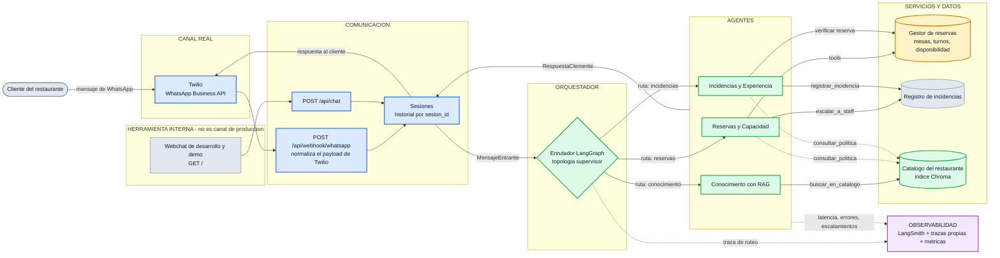
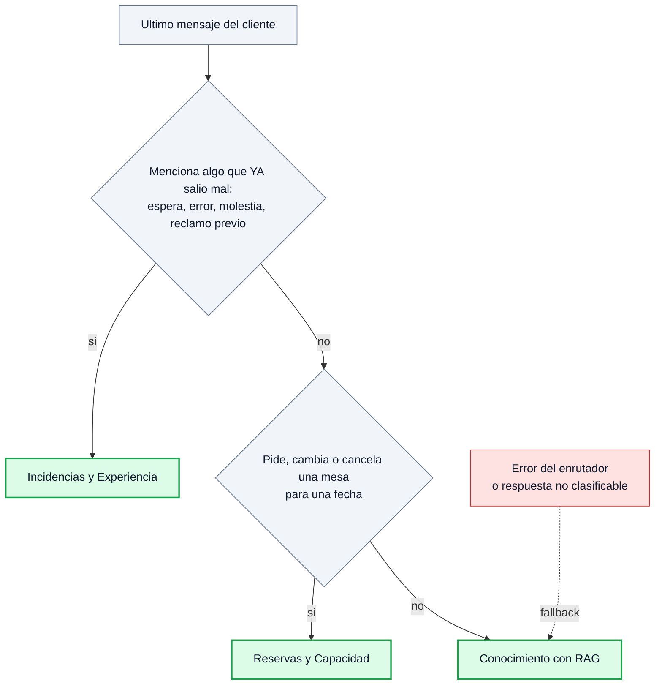
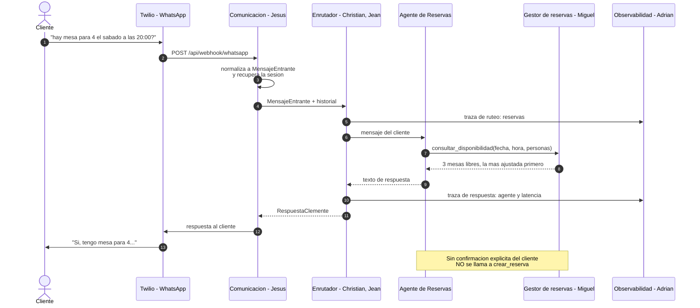

# Clemente — asistente multiagente para restaurantes

Proyecto final del **Programa en Diseño e Implementación de Agentes IA** (UTEC Posgrado) — **Grupo 02**.
Implementa la arquitectura declarada en el *Entregable 01*: **tres agentes especializados**
coordinados por un orquestador, expuestos por un único canal conversacional.

**Alcance cerrado del entregable:** los tres agentes (Reservas y Capacidad, Incidencias y
Experiencia, Conocimiento). El flujo de pedidos, delivery y recojo del caso de estudio **queda
fuera**. Canal real: **WhatsApp vía Twilio**; el webchat incluido es solo para desarrollar y
demostrar sin depender de Twilio.

> ### Estado de esta rama (`feat/setup-base`)
>
> Esta rama trae **el esqueleto completo del proyecto**: contratos entre módulos, capa de
> comunicación, gestor de reservas, registro de incidencias, observabilidad, catálogo del
> restaurante, pruebas y documentación.
>
> **El orquestador y los tres agentes van como *stubs***: respetan el contrato y devuelven una
> respuesta fija. Es decir, **la aplicación arranca, responde y deja trazas incluso sin clave de
> API**, pero todavía no razona. La implementación real (grafo LangGraph, `create_agent`, tools y
> RAG) la suben Christian y Jean en las ramas `feat/orquestador-ruteo` y `feat/agentes-*`.
>
> El objetivo de subirlo así es que Jesús, Miguel y Adrián puedan trabajar **hoy** contra
> interfaces que ya no van a cambiar.
>
> Detalle esperable: `GET /api/salud` responde `sin_credencial` hasta que pongas una clave en el
> `.env`. Es correcto — hará falta cuando lleguen los agentes reales; los *stubs* no la usan.

---

## 1. Cómo funciona, en una página

Un servidor **Flask** recibe un mensaje, un **enrutador LangGraph** decide cuál de los tres
agentes lo atiende, ese agente ejecuta sus *tools* contra los servicios del restaurante, y la
respuesta vuelve por el mismo canal. Todo el camino queda trazado.



**Colores = responsable.** Azul: Jesús (canal WhatsApp con Twilio, comunicación y sesiones).
Verde: Christian y Jean (orquestador, los tres agentes y el RAG). Ámbar: Miguel (gestor de
reservas). Morado: Adrián (observabilidad). Gris: piezas comunes del proyecto — entre ellas el
**webchat, que es una herramienta interna de desarrollo y demostración: no pasa por Twilio ni
forma parte del canal de producción**.

**Topología: *Supervisor*** (Sesión 15). Un solo punto decide quién actúa; los agentes no se
hablan entre sí. Eso da un único lugar donde auditar por qué se eligió cada agente, y hace que
agregar un cuarto agente sea un módulo más, no un rediseño.

### Los tres agentes

Se diferencian por **alcance y costo de equivocarse**, no por tecnología: los tres se construyen
igual (`create_agent` de LangChain) y solo cambian su *prompt* de sistema y su caja de *tools*.

| Agente | Atiende | Tools | Límite duro (guardrail) |
|---|---|---|---|
| **Reservas y Capacidad** | disponibilidad, reservar, modificar, cancelar | `consultar_disponibilidad`, `crear_reserva`, `buscar_mis_reservas`, `modificar_reserva`, `cancelar_reserva`, `escalar_a_staff`, `consultar_politica` | no afirma disponibilidad sin consultarla; no registra sin confirmación explícita; grupos de más de 10 personas escalan al *staff* |
| **Incidencias y Experiencia** | lo que ya salió mal | `registrar_incidencia`, `consultar_incidencia`, `verificar_reserva_del_reclamo`, `consultar_politica` | **no existe** tool para cerrar una incidencia ni para dar compensaciones: no puede hacerlo aunque el *prompt* falle |
| **Conocimiento** (RAG) | horarios, ubicación, carta, servicios, políticas | `buscar_en_catalogo`, `consultar_politica` | responde solo desde el catálogo validado; no afirma ni niega cupo para una fecha |

### Cómo decide el enrutador



La regla 1 gana sobre la 2 aunque el mensaje también pida mesa: un reclamo con una reserva
dentro sigue siendo un reclamo. El *fallback* es `conocimiento` porque es el agente más barato
de equivocarse — nunca compromete capacidad del local.

**RAG** (*Retrieval-Augmented Generation*, generación aumentada por recuperación): el catálogo
del restaurante vive en `app/agentes/rag/documentos/` y se indexa en **Chroma**. Es la **fuente
única de verdad**: Reservas e Incidencias consultan las políticas ahí con `consultar_politica`
en lugar de llevar su propia copia en el *prompt*.

## 2. Quién hace qué

| Frente | Responsable | Carpeta |
|---|---|---|
| Comunicación y conexión con WhatsApp (Twilio) | **Jesús** | `app/comunicacion/` |
| Orquestador + los 3 agentes + RAG | **Christian, Jean** | `app/orquestador/`, `app/agentes/` |
| Gestor de reservas | **Miguel** | `app/reservas/` |
| Observabilidad | **Adrián** | `app/observabilidad/` |
| Registro de incidencias | Christian, Jean (provisional) | `app/incidencias/` |

**Archivos compartidos** — no se editan en solitario: `app/contratos.py`, `app/config.py`,
`app/llm.py`, `app/__init__.py`, `requirements.txt`, `.env.example`.

Reglas de trabajo, ramas y decisiones abiertas: [`ACUERDOS_EQUIPO.md`](ACUERDOS_EQUIPO.md).

## 3. Puesta en marcha

**Requisitos**

- **Python 3.11+** (probado en 3.13; `chromadb` aún no publica *wheels* para 3.14).
- **Una clave de API**: `ANTHROPIC_API_KEY` u `OPENAI_API_KEY`. El razonamiento del agente corre
  sobre API — decisión del equipo, tomada tras medir que el modelo local inventaba datos
  (sección 9).
- **Ollama** solo para los *embeddings* del RAG, que siguen siendo locales y gratuitos:
  `ollama pull nomic-embed-text`. Alternativa sin Ollama: `EMBEDDINGS_BACKEND=openai`.
- **Clave de LangSmith** (`LANGSMITH_API_KEY`) para la observabilidad compartida.

**Instalación**

```bash
cd Clemente_Multiagente
python -m venv .venv
.venv\Scripts\activate            # Windows;  mac/linux: source .venv/bin/activate
pip install -r requirements.txt
copy .env.example .env            # mac/linux: cp .env.example .env
```

**Configuración mínima del `.env`**

```ini
AGENT_MODEL=claude                # o: openai
ANTHROPIC_API_KEY=...
ANTHROPIC_MODEL=claude-sonnet-5
LANGSMITH_TRACING=true
LANGSMITH_API_KEY=...
LANGSMITH_PROJECT=clemente-grupo02
```

**Elección de modelo** (precio por millón de tokens, entrada / salida):

| `AGENT_MODEL` | Modelo | Contexto | Precio | Para qué |
|---|---|---|---|---|
| `claude` | `claude-opus-5` | 1M | $5 / $25 | el más capaz — demostración final |
| `claude` | `claude-sonnet-5` | 1M | $2 / $10 | día a día de desarrollo |
| `claude` | `claude-haiku-4-5` | 200K | $1 / $5 | evaluaciones en lote del enrutador |
| `openai` | confirmar el ID vigente en [platform.openai.com/docs/models](https://platform.openai.com/docs/models) | — | — | alternativa acordada |
| `llama3.2` | Ollama local | 128K | gratis | trabajar sin conexión o sin gastar crédito |

Los IDs de Claude van **sin sufijo de fecha** (`claude-sonnet-5`, no `claude-sonnet-5-2025…`).
Cambiar de proveedor o de modelo es una línea del `.env`: no se toca el código de ningún agente.

**Ejecución y verificación**

```bash
python run.py                     # http://localhost:5000
curl http://localhost:5000/api/salud
pytest -q                         # 17 pruebas de contrato, no llaman al modelo
```

`GET /api/salud` responde `{"estado": "sin_credencial", "falta": "ANTHROPIC_API_KEY"}` si el
`.env` está incompleto — arrancar sin clave es visible, no un misterio. Sin clave el chat no se
cae: responde con un mensaje de escalamiento y `escalado: true`.

El índice del RAG se construye solo en la primera consulta al Agente de Conocimiento. Tras
editar los documentos del catálogo, o tras cambiar `EMBEDDINGS_BACKEND`:

```bash
python -m app.agentes.rag.indice --reindexar
```

## 4. API HTTP

| Método y ruta | Descripción |
|---|---|
| `GET /` | webchat de demostración (muestra qué agente respondió y por qué) |
| `POST /api/chat` | API interna de conversación |
| `POST /api/webhook/<canal>` | entrada del canal externo — `whatsapp` es el que se usará con Twilio |
| `POST /api/sesiones/<id>/reset` | reinicia un hilo de conversación |
| `GET /api/salud` | proveedor, modelo, *backends* y credenciales faltantes |
| `GET /api/trazas?sesion_id=&limite=` | últimas trazas (ruteo, latencia, errores) |
| `GET /api/metricas` | métricas agregadas para el informe final |

**`POST /api/chat`**

```jsonc
// petición
{ "mensaje": "¿tienen mesa para 4 el sábado a las 20:00?",
  "sesion_id": "s1", "canal": "webchat", "nombre": null, "telefono": null }

// respuesta
{ "respuesta": "Sí, tengo mesa para 4 …",
  "agente": "reservas",              // reservas | incidencias | conocimiento | orquestador
  "motivo_ruta": "pide una mesa para una fecha",
  "sesion_id": "s1",
  "escalado": false }
```

**`GET /api/metricas`**

```json
{ "conversaciones": 1, "mensajes_atendidos": 4, "errores": 0,
  "latencia_media_ms": 4437.5,
  "ruteos_por_agente": { "conocimiento": 2, "incidencias": 1, "reservas": 1 } }
```

## 5. Qué ocurre con un mensaje, paso a paso

1. **Canal** — `app/comunicacion/rutas.py` recibe el POST y `_normalizar()` traduce el formato
   del canal a un `MensajeEntrante`. Twilio envía `From`, `Body` y `ProfileName` como formulario;
   ese parseo es el trabajo pendiente de Jesús.
2. **Sesión** — `app/comunicacion/sesiones.py` recupera el hilo (`sesion_id`) con su historial,
   acotado a los últimos 20 turnos: la ventana de contexto es un recurso escaso (Sesión 9).
3. **Ruteo** — el nodo `enrutador` de `app/orquestador/grafo.py` clasifica con
   `with_structured_output(DecisionRuta)` a temperatura 0. Si el enrutador falla, cae a
   `conocimiento`, que es el agente más barato de equivocarse porque nunca compromete capacidad.
4. **Agente** — `add_conditional_edges` despacha al nodo correspondiente. El agente corre su
   ciclo: piensa, llama tools, lee resultados, responde.
5. **Tools y servicios** — ninguna tool toca un archivo directamente: llaman a `app/reservas`,
   `app/incidencias` o al índice RAG a través de la interfaz declarada en `contratos.py`.
6. **Guardrail de salida** — `app/agentes/base.py` descarta respuestas en las que el modelo
   escribió la llamada a una herramienta como texto JSON en vez de invocarla, y registra el evento.
7. **Respuesta y traza** — el canal devuelve la respuesta, guarda el turno en la sesión, y la
   observabilidad registra ruteo, latencia y errores.



El `sesion_id` **no viaja en el prompt**: se fija en un `ContextVar`
(`app/agentes/contexto.py`) que las tools leen. Un dato que el sistema ya conoce no se le pide
al modelo.

## 6. Contratos entre módulos

[`app/contratos.py`](app/contratos.py) es la costura del proyecto: define **qué datos cruzan de
un módulo a otro**, no cómo se producen. Mientras no cambie, cada quien reescribe su módulo por
dentro sin romper el de nadie.

| Tipo | Va de | a | Campos clave |
|---|---|---|---|
| `MensajeEntrante` | canal | orquestador | `sesion_id`, `texto`, `canal`, `nombre_cliente`, `telefono` |
| `RespuestaClemente` | orquestador | canal | `texto`, `agente`, `motivo_ruta`, `escalado`, `datos` |
| `ServicioReservas` (interfaz) | agentes | gestor de reservas | `consultar_disponibilidad`, `crear_reserva`, `obtener_reserva`, `buscar_reservas_de`, `modificar_reserva`, `cancelar_reserva` |
| `Reserva`, `OpcionDisponibilidad` | gestor | agentes | `id`, `fecha`, `hora`, `personas`, `zona`, `mesa_id`, `estado` |
| `ServicioIncidencias` (interfaz) | agentes | registro | `crear_incidencia`, `listar_incidencias`, `cerrar_incidencia` |
| `Incidencia` | registro | agentes | `id`, `tipo`, `estado`, `responsable`, `plazo_horas` |
| `Fragmento` | RAG | Agente de Conocimiento | `texto`, `fuente`, `score` |
| `Traza` | todos | observabilidad | `evento`, `sesion_id`, `agente`, `duracion_ms`, `detalle` |

## 7. Datos y reglas de negocio

| Dato | Dónde | Nota |
|---|---|---|
| Mesas y zonas | `app/reservas/datos/mesas.json` | declarado por la operación; el agente **no** inventa mesas |
| Reservas | `app/reservas/datos/reservas.json` | generado, en `.gitignore` |
| Incidencias | `app/incidencias/datos/incidencias.json` | generado, en `.gitignore` |
| Catálogo (horarios, carta, políticas) | `app/agentes/rag/documentos/*.md` | versionado en git: es la fuente de verdad |
| Índice vectorial | `app/agentes/rag/chroma_index/` | generado, en `.gitignore` |

Reglas codificadas, no sugeridas al modelo: turnos válidos `12:00 13:00 14:00 19:00 20:00 21:00
22:00`; una mesa reservada bloquea su turno completo; grupos de más de 10 personas escalan al
*staff*; plazos de incidencia por tipo (espera y reserva 4 h, servicio y producto 8 h, otros 24 h).

La implementación actual del gestor de reservas es sobre archivos JSON y es **de referencia**:
Miguel la reemplaza respetando la interfaz `ServicioReservas` (ver la decisión de persistencia
en `ACUERDOS_EQUIPO.md`).

## 8. Observabilidad

Dos niveles, los dos encendidos por defecto:

- **LangSmith** — traza automática de cada llamada al modelo y a cada tool. Se activa con
  `LANGSMITH_TRACING=true` y `LANGSMITH_API_KEY`; el proyecto (`LANGSMITH_PROJECT`) es
  **compartido**, para que las trazas de los cinco caigan juntas. Si falta la clave, el sistema
  lo avisa en el arranque y sigue funcionando sin trazado remoto.
- **Trazas propias** (`app/observabilidad/trazas.py`) — eventos de negocio que LangSmith no
  conoce: qué ruta eligió el enrutador y por qué, cuánto tardó cada agente, cuántos casos se
  escalaron, cuántas respuestas inválidas descartó el guardrail. Alimentan `/api/metricas` y el
  informe final.

## 9. Estado y hallazgos

| Pieza | Estado |
|---|---|
| Esqueleto Flask, contratos, pruebas | listo |
| Orquestador (enrutador supervisor) | **stub en esta rama** — enruta por palabras clave, sin modelo. El grafo LangGraph llega en `feat/orquestador-ruteo` |
| Los 3 agentes con sus tools | **stub en esta rama** — solo respetan la firma. Llegan en `feat/agentes-*` |
| RAG del Agente de Conocimiento | el **catálogo** (`rag/documentos/`) ya está en esta rama; el indexador Chroma llega con los agentes |
| Gestor de reservas | referencia en JSON — Miguel la reemplaza |
| Observabilidad | trazas y métricas propias; LangSmith activable por `.env` |
| Conexión WhatsApp (Twilio) | pendiente — Jesús |
| Memoria de largo plazo (perfil del cliente) | pendiente |
| Panel del *staff* | pendiente |

### Prueba de extremo a extremo del 2026-09-03 (modelo local `llama3.2`)

El andamiaje funcionó completo: ruteo, ejecución de tools, reserva escrita en disco, incidencia
con plazo y métricas. Lo que falló fue la **calidad del modelo local**, y es la razón por la que
el equipo decidió mover el razonamiento a API:

| Qué pasó | Gravedad |
|---|---|
| El Agente de Conocimiento **inventó** que el estacionamiento es "en la calle principal, gratuito"; el catálogo dice convenio con la playa de Av. Grau 410 y dos horas liberadas | alta — es justo lo que ese agente no debe hacer |
| "¿Hay mesa para 4 el 2026-09-12 a las 20:00?" se enrutó a **Conocimiento**, que además **negó disponibilidad** | alta — Conocimiento no puede hablar de cupo |
| Reservas **creó bien** la reserva (`R-E1DB80`) pero respondió un texto incoherente | media — acción correcta, respuesta mala |
| Incidencias **inventó el código** `CI-1234` sin llamar a la tool: el reclamo no quedó registrado | alta |
| El modelo escribió una llamada a herramienta como texto JSON, inventando una tool inexistente | resuelto con el guardrail de `agentes/base.py` |

Estas cinco filas son la línea base de la evaluación del Módulo 8: hay que repetir la misma
prueba con el modelo de API y comparar.

## 10. Estructura del repositorio

```
Clemente_Multiagente/
  run.py                       punto de entrada
  requirements.txt             dependencias comunes          <- compartido
  .env.example                 plantilla de configuración    <- compartido
  app/
    __init__.py                create_app(): app factory + blueprints
    config.py                  configuración leída del .env
    llm.py                     resolución de modelo y embeddings
    contratos.py               costuras entre módulos        <- compartido
    comunicacion/              Jesús — canales, sesiones, webhook de WhatsApp
    orquestador/grafo.py       Christian, Jean — enrutador (STUB por palabras clave en esta rama)
    agentes/                   Christian, Jean
      __init__.py              registro AGENTES: el contrato que ve el orquestador
      reservas.py  incidencias.py  conocimiento.py   <- STUBS en esta rama
      rag/documentos/          catálogo del restaurante (horarios, carta, políticas)
      (prompts.py, base.py, contexto.py, tools/, rag/indice.py llegan en feat/agentes-*)
    reservas/                  Miguel — gestor de reservas
    incidencias/               registro de incidencias
    observabilidad/            Adrián — trazas, métricas, LangSmith
    web/templates/chat.html    webchat de demostración
  tests/                       17 pruebas de contrato (sin llamar al modelo)
```

## 11. Documentos del proyecto

- Acuerdos de trabajo y decisiones: [`ACUERDOS_EQUIPO.md`](ACUERDOS_EQUIPO.md)
- Definición del problema y de los tres agentes: `../Entregable N° 01 - GRUPO 02.docx`
- Caso de estudio original: `../../Idea - Clemente para Restaurantes Caso de Estudio.md`
