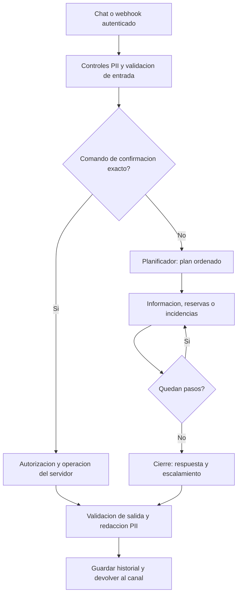

# Guia del codigo de Clemente

Revision documental: 2026-09-18. Esta guia describe `Clemente_Multiagente` en la rama de integracion `fix/guardrails-canales`, no la carpeta paralela `Entregable_Final/clemente` ni los ejercicios historicos del curso. El [indice completo](INDICE_CODIGO.md) enlaza cada modulo, clase, metodo y funcion de Python con su descripcion. Las fuentes conservan docstrings junto a cada definicion.

## Como leer la documentacion

Los docstrings explican el proposito de la funcion y, cuando corresponde, sus entradas, resultado, cambios de estado, persistencia y errores. Una funcion auxiliar simple puede tener una descripcion breve; los nodos y las operaciones de negocio necesitan explicar su contrato y sus limites. Los comentarios internos explican decisiones puntuales y no sustituyen la descripcion de la funcion.

Las herramientas decoradas con `@tool` y `@mcp.tool` tienen una particularidad: su docstring tambien puede convertirse en la descripcion que recibe el modelo o cliente MCP. Al editarlo hay que mantener los parametros consistentes con la firma y describir permisos reales; nunca anunciar una capacidad que el cuerpo no implementa.

## Recorrido de un mensaje



1. Los controllers normalizan JSON o formularios de Twilio. `chat_controller` usa la cookie firmada; `whatsapp_controller` exige firma Twilio y procesa en segundo plano. Ambos llegan a `app/communication/services/chat_service.py:handle_incoming_message`, que aplica los controles antes del orquestador.
2. `app/orquestador/grafo.py:responder` intenta validar `CONFIRMO <codigo>` fuera del modelo. Para texto conversacional invalida la propuesta anterior y ejecuta `obtener_grafo().invoke(estado_inicial)`.
3. LangGraph recorre el plan y el cierre. El contexto de negocio se comparte entre componentes; cada uno recibe el mensaje del cliente y el historial previo.
4. El canal valida la salida, redacta PII y agrega los mensajes al historial. La respuesta del orquestador incluye el plan en `datos`; el chat HTTP actual no devuelve todos esos datos en su JSON.

## Contrato de los nodos

Los nodos devuelven un diccionario de actualizaciones del estado de LangGraph. No devuelven el objeto HTTP de Flask. El grafo externo utiliza `EstadoConversacion`, un `TypedDict` cuyos campos son opcionales para permitir entradas manuales desde Studio.

| Nodo o funcion | Lee | Produce o cambia | Efectos y errores |
|---|---|---|---|
| `_nodo_planificador` | `mensaje`, `historial`, `ultimo_agente`, `sesion_id` | `plan`, `paso=0`, `motivo_ruta`, `respuestas=[]` | Llama al modelo con `PlanDeResolucion` y registra el plan. Sin texto no llama al modelo. Un fallo de invocacion usa continuidad o informacion; errores de construccion del modelo se propagan. |
| `_nodo_trabajo(nombre)` | Nombre de un componente de `NODOS` | Una funcion `nodo(estado)` | Es una fabrica utilizada al construir el grafo; no atiende el turno por si sola. |
| `nodo`, ejecutor de informacion | Mensaje, historial, sesion y contexto | Agrega `{agente: informacion, texto}` a `respuestas`; incrementa `paso` | Usa el componente LangChain de lectura del catalogo y politicas; mide duracion. |
| `nodo`, ejecutor de reservas | Los mismos campos | Agrega respuesta de reservas, incrementa `paso` y conserva contexto | Las tools preparan operaciones; la escritura confirmada pertenece al servidor. Una excepcion de grupo puede interrumpirse para revision humana. |
| `nodo`, ejecutor de incidencias | Los mismos campos | Agrega respuesta de incidencias, incrementa `paso` y conserva contexto | Puede registrar y consultar casos mediante sus tools; no tiene herramienta de cierre ni compensacion. |
| `_siguiente` | `plan`, `paso` | Nombre del siguiente componente o `cierre` | Funcion de transicion, no nodo registrado. No llama al LLM ni modifica estado; aplica `PASOS_MAXIMOS`. |
| `_nodo_cierre` | `respuestas`, sesion, mensaje y contexto | `respuesta`, `ruta`, `contexto` | Usa el resumen del servidor cuando hay confirmacion pendiente; en otros casos sintetiza. Crea o actualiza el caso de escalamiento y sustituye promesas por el codigo obtenido. Ante fallo de escalamiento informa el error. |

El limite actual es de dos pasos, sin componentes repetidos. Por ejemplo, `incidencias -> reservas -> cierre` atiende una queja y un pedido de mesa en un mismo turno. El segundo componente recibe el contexto compartido, pero la respuesta del primero no se agrega automaticamente a su historial. No se implementa aqui una replanificacion despues de cada resultado ni una delegacion paralela.

## LangChain y LangGraph en el codigo

`app/agentes/base.py:construir_agente` importa `create_agent` desde `langchain.agents`. Le entrega modelo, prompt, tools, `context_schema`, middleware PII y, si se proporciona, checkpointer. Reservas e incidencias reutilizan esta fabrica; informacion tambien usa tecnicamente un agente LangChain, aunque se agrupa como componente del orquestador y no aparece en `AGENTES`.

`app/orquestador/grafo.py:_construir_grafo` importa `StateGraph`, registra los nodos, conecta `START`, configura las aristas condicionales y llama `compile()`. `responder` invoca ese grafo compilado. Esas llamadas constituyen la evidencia de uso explicito de LangGraph.

El grafo externo no configura checkpointer. El agente de reservas mantiene un checkpoint SQLite para HITL, y `reanudar_revision` usa `Command(resume=...)` con el mismo `thread_id`. Los historiales de chat y registros de continuidad del proceso son mecanismos distintos del checkpoint.

Para obtener el diagrama de la topologia real, desde la carpeta del proyecto y con sus dependencias instaladas:

```powershell
python -m app.orquestador.grafo
```

`tests/test_orquestador.py:test_un_plan_de_dos_pasos_recorre_los_dos_agentes` comprueba el recorrido del grafo con plan y componentes simulados. No prueba que un modelo real elija ese plan; esa evidencia requiere una corrida real y sus trazas.

## Guardrails y sus limites

| Capa | Archivo | Control |
|---|---|---|
| Entrada y salida del canal | `app/communication/services/chat_service.py` | Integra bloqueo PII, validacion externa, sustitucion de texto rechazado y redaccion del historial. |
| Patrones locales | `app/seguridad/pii.py` | Bloquea tarjetas y secretos; redacta patrones de correo, DNI, IP, MAC y telefono. No detecta automaticamente nombres propios ni toda PII posible. |
| Middleware del agente | `app/agentes/base.py`, `app/seguridad/pii.py` | `PIIMiddleware` para correos y tarjetas en entrada, salida y resultados de tools. |
| Validacion externa | `app/seguridad/guardrails_ai.py`, `guardrails_service/app.py` | Cliente HTTP y servicio con `DetectJailbreak`, `ToxicLanguage` y patron local de amenazas graves. |
| Permisos de reservas | `app/agentes/autorizacion.py`, `app/agentes/tools/reservas_tools.py` | Propiedad por sesion y permiso exacto de un uso, con parametros y vigencia. Saber un telefono o codigo no concede acceso. |
| Revision humana | `app/agentes/reservas.py`, `app/agentes/base.py`, `app/orquestador/grafo.py` | Middleware HITL, checkpoint y cola protegida del personal para excepciones de grupos. Aprobar permite tramitar el caso; no confirma una mesa automaticamente. |
| Herramientas disponibles | `app/orquestador/informacion.py`, `app/agentes/tools/`, `app/incidencias/mcp_trello.py` | El componente de informacion solo lee; incidencias no expone cierre o compensacion; MCP publica un catalogo limitado. |
| Respuesta verificable | `app/orquestador/grafo.py:_nodo_cierre` | Prioriza propuestas del servidor y codigos obtenidos del servicio sobre afirmaciones del modelo. No es un detector general de alucinaciones. |
| Fecha y dia de la semana | `app/agentes/fecha.py`, `app/agentes/tools/fecha_tools.py`, `app/agentes/autorizacion.py`, `app/agentes/tools/reservas_tools.py` | Reloj en `America/Lima` inyectado en cada turno (`base._armar_entrada`) y tool `get_current_datetime` trazada. El servidor rechaza fechas pasadas y contradicciones entre `dia_semana` y la fecha antes de consultar o preparar una reserva, y lo deja en `guardrail_fecha`. No interpreta lenguaje natural ("el finde"): eso lo resuelve el modelo con la tool. |
| Plan recortado | `app/orquestador/grafo.py:_pasos_descartados`, `_aviso_pendientes` | Un mensaje con mas temas que `PASOS_MAXIMOS` conserva los descartados en `pendientes`; el cierre le dice al cliente que quedo fuera y la traza `plan_recortado` lo cuenta. No afirma haber resuelto lo que no atendio ni prioriza reclamos por si mismo. |
| Auditorias de salida | `app/orquestador/controles.py` | Deja en la traza un saludo con presentacion sobre un hilo activo (`reinicio_detectado`) y ofertas de descuento, cortesia o regalo sin negacion (`promesa_no_autorizada`). Son heuristicas: no bloquean ni sustituyen la revision del personal. |
| Estado compartido de agentes | `app/agentes/almacen.py`, `app/db/migrations/0003_create_estado_agentes.sql` | Permisos, propuestas CONFIRMO, perfil, cola HITL, resoluciones, continuidad y rechazos en las tablas `agentes_*` del mismo Postgres/pool que reservas y mensajes (`CLEMENTE_BACKEND_AGENTES`, en `auto` sigue a reservas). El token de un uso es atomico (`BEGIN IMMEDIATE` local, `DELETE ... RETURNING` en Postgres). Requiere contexto Flask, igual que el servicio de Marc. El checkpoint LangGraph del agente de reservas sigue en SQLite (`CLEMENTE_DATOS_DIR`). |
| Contrato de errores de tools | `app/agentes/servicios.py`, `app/agentes/autorizacion.py`, `app/agentes/tools/reservas_tools.py` | `ValueError` del servicio = regla de negocio (texto de siempre). Cualquier otra excepcion = infraestructura: `NO_DISPONIBLE` sin propuesta, traza `servicio_error`, `datos.servicio_reservas`. Un fallo al escribir tras consumir el token devuelve `ESCRITURA_INCIERTA` y no reintenta. Nunca se presenta una base caida como "sin mesa" ni como exito. |
| Perfil del cliente | `app/agentes/memoria.py`, `app/agentes/tools/cliente_tools.py` | Clave = identidad del servidor (telefono autenticado del canal o sesion firmada); un telefono escrito en el mensaje es dato, no clave. `anotar_dato_cliente` guarda alergias/preferencias/nombre y la ficha las inyecta con la instruccion de confirmarlas al reservar y al llegar. No es un control de seguridad alimentaria. |
| Resolucion HITL diferida | `app/orquestador/grafo.py:_con_resolucion_pendiente` | El panel del staff no envia mensajes: la decision queda en `agentes_resoluciones` y se antepone a la respuesta del siguiente turno del cliente, una sola vez (`hitl_entregado`, `datos.resolucion_entregada`). |
| Degradacion por abuso | `app/agentes/abuso.py` | Cuenta rechazos del servidor por sesion (token invalido/ajeno, autorizacion denegada) en una ventana (`CLEMENTE_MAX_RECHAZOS`, `CLEMENTE_ABUSO_VENTANA`). Al superarla, `responder` contesta con texto fijo como agente `seguridad` sin invocar al modelo (`abuso_degradado`). Una escritura incierta o un cambio de disponibilidad no cuentan. |
| Redaccion de spans LangSmith | `app/seguridad/trazado.py`, `app/observabilidad/trazas.py:configurar_observabilidad` | Instala el cliente de LangSmith con `hide_inputs`/`hide_outputs` que pasan por `redactar_pii`; si no puede, activa `LANGSMITH_HIDE_INPUTS/OUTPUTS`. Cubre los patrones de `pii.py`, no nombres propios. La verificacion span por span sigue siendo manual con un proyecto de prueba. |

Si Guardrails AI no tiene URL o falla su transporte/respuesta, el cliente aplica una politica de continuidad: `permitido=True`, `disponible=False`. Los controles locales siguen activos, pero no se garantiza validacion externa de jailbreak o toxicidad. Llamar directamente a `responder` del orquestador, como hacen algunos corredores de evaluacion, omite los validadores HTTP del canal.

## Mapa de modulos

| Carpeta o archivo | Responsabilidad |
|---|---|
| `run.py`, `app/__init__.py`, `app/config.py` | Inicio, fabrica Flask y configuracion del entorno. |
| `studio.py`, `langgraph.json` | Exportacion del grafo para Studio y configuracion del CLI. |
| `mcp_server.py` | Inicio del servidor MCP de incidencias. |
| `app/contratos.py` | Dataclasses y protocolos compartidos; no valida identidad ni disponibilidad. |
| `app/communication/` | Sesiones en memoria, normalizacion, endpoints del chat, webhook y personal. |
| `app/orquestador/` | Planificacion, recorrido, informacion, sintesis, escalamiento y revisiones. |
| `app/agentes/` | Fabrica y ejecucion de agentes, contexto, prompts, memoria auxiliar y autorizacion. |
| `app/agentes/tools/` | Herramientas con contratos, permisos y trazas. |
| `app/agentes/rag/` | Extraccion, fragmentacion, indice (Chroma local o Azure AI Search segun `RAG_BACKEND`) y recuperacion del catalogo. Las tools de catalogo no distinguen el backend; un fallo remoto queda en la traza `rag_error` y no llega al modelo. |
| `app/reservas/` | Servicios JSON y Postgres, disponibilidad y escrituras transaccionales de reservas. |
| `app/db/` | Pool, migraciones y repositorios de clientes, chats y mensajes Postgres. La migracion `0003` agrega las tablas `agentes_*` del estado de los agentes; el pool se comparte, las tablas no se mezclan. |
| `app/incidencias/` | Backends JSON, Trello y MCP, con respaldo local. |
| `app/seguridad/`, `guardrails_service/` | Redaccion PII, cliente de validacion y servicio de validadores. |
| `app/observabilidad/` | Eventos, duraciones, conversaciones persistidas y metricas del proceso. |
| `app/web/templates/chat.html` | Interfaz del chat y panel HITL; comentarios del script describen sus funciones. |
| `tests/test_*.py`, `tests/conftest.py` | Comprobaciones locales con archivos temporales, modelos y HTTP simulados. El backend Postgres de la suite es destructivo (borra `reservas`): solo corre contra `CLEMENTE_TEST_DATABASE_URL` o una `CLEMENTE_DATABASE_URL` en localhost, nunca contra la base compartida. |
| `tests/eval/`, `tests/evals/` | Dataset y corredores de evaluacion real, juez, metricas y LangSmith. |
| `tests/seguridad/` | Red team, aislamiento, evidencias, presupuesto y comprobaciones de integracion. |

El webhook actual verifica la firma de Twilio y conserva el procesamiento asincrono. `message_service.process_incoming_message` llama al flujo protegido antes de guardar mensajes redactados en Postgres y enviar la respuesta. El puente simulado `llm_bridge` permanece para pruebas historicas; el controller de WhatsApp no lo utiliza. El servicio Trello guarda primero en JSON y puede devolver un codigo aunque falle la tarjeta remota; el codigo no demuestra entrega o notificacion. La API `/salud` y `/health` del validador comprueban condiciones locales y no ejercitan todos los servicios.

Los historiales y trazas en memoria se pierden al reiniciar; conversaciones JSONL, reservas y checkpoints tienen persistencia separada. Con `CLEMENTE_BACKEND_AGENTES=postgres` (o `auto` con reservas en Postgres), permisos, propuestas, perfiles, cola HITL, resoluciones, continuidad y rechazos sobreviven al reinicio y se comparten entre replicas; en `local` viven en SQLite/JSON/memoria del proceso. El servicio de reservas JSON no proporciona bloqueo transaccional entre procesos. `/api/salud` muestra en `backends` donde escribe cada modulo.

## Mantener y verificar la documentacion

Desde la carpeta del proyecto:

```powershell
python docs/verificar_documentacion.py
python docs/verificar_documentacion.py --indice docs/INDICE_CODIGO.md
```

La herramienta recorre codigo propio de Python, incluidas clases, metodos y closures, compila las fuentes sin ejecutarlas y falla si hay errores o descripciones ausentes/vacias. No importa Flask, LangChain o Guardrails AI y no necesita esas dependencias. Las funciones JavaScript de la plantilla se revisan aparte; no forman parte del contador Python.

Cuando se cambie una funcion, actualizar su docstring y sus contratos en esta guia si cambia el flujo. Regenerar el indice para actualizar nombres y lineas. Revisar que proposito, parametros, devolucion, persistencia, errores y controles coincidan con el cuerpo; la presencia de un docstring no prueba su calidad.

La revision original del 2026-09-17 verifico que insertar docstrings no cambiara el AST ejecutable. La integracion del 2026-09-18 cambia deliberadamente el flujo de los canales y se verifica con pruebas funcionales. Los resultados y limites actuales se registran en [PR_GUARDRAILS.md](PR_GUARDRAILS.md).
